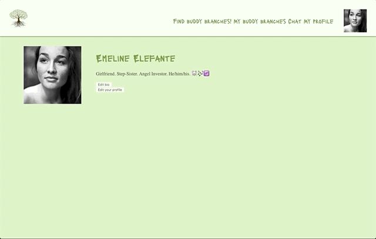
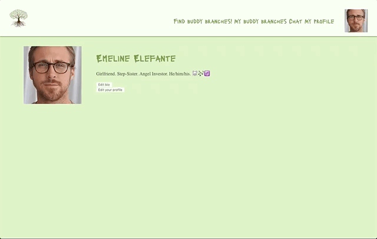
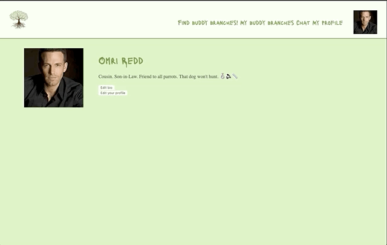
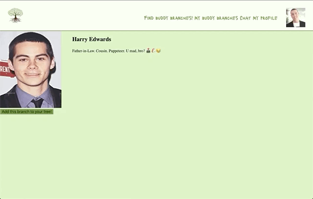
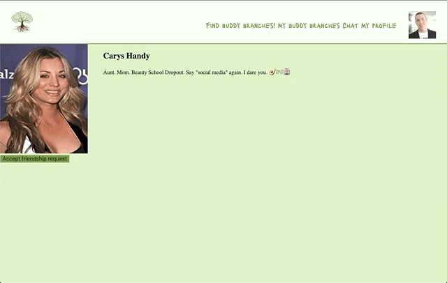
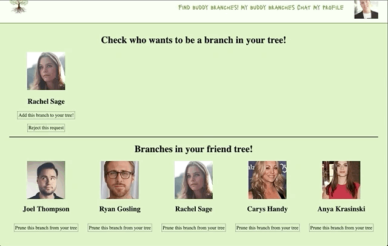
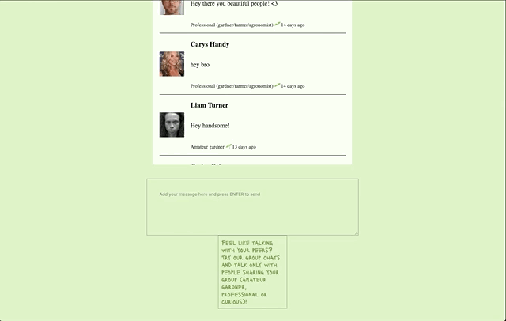

# MYCORRHIZAE - The social media 

## Description:

Social media that allows people interested in urban agriculture and gardening to make friends and participate on interesting discussion with their peers. 

## Developed with:

- PostgreSQL for database management
- AWS S3 for storaging user pictures
- Socket-IO for instantaneous chats including:
  - Extra Namespace and three different Rooms for each group chat
- Express / Node-js for server functions
- ReactJs for the modular page development in components, including:
  - Hooks API
  - Redux
- Moment.Js for processing time tags from chat messages
- Bcryptjs for password encription
- Cookie-Session for cookie encription
- Inline-CSS in each component for styling 

## Features:

Users are welcomed with a page that allows them to register or login, in case they have a profile already. Upon registration the user is asked on which group he fills better: amateur gardner, professional on the field or curious.

Upon login, users are welcomed by their personal profile page, which offers them many editing possibilities.

- Profile can be edited at any time by clicking on the top right picture or on the personal profile page, by clicking on the bigger picture

- Bio and profile info can also be edited by clicking on the specific buttons on user's profile

From the top menu users can find other users of Mycorrhizae and visit their profiles. At first they will see the last three people who joined the network, having the option to search by name for other users.

Users can make friendship requests to other users while visiting their profiles. The button than changes, allowing users to cancel that request:

If that user has made a friendship request, it is possible to accept it while visiting his/her profile. The button than allows us to finish this friendship

Users can also see the complete list of users that are already their friends and of users that had made friendship requests. Here it is also possible to accept a friendship request, having that user immediately added to your friends list. Finishing a friendship can also be done through here. 

In order to communicate with other users, it is possible to participate on an open chat. On this chat it is possible to see when people send their messages and their group of interest (amateur, professional or curious). Messages are instantly updated on the chat area when sent

When interested, users can also choose to join a chat room that only include people from the same interest group they have on their profile

## Features to be added:

- Private chats
- Log out
- Delete your profile (including the deletion of all pictures from AWS S3)
- Notifications when user gets friendship requests

